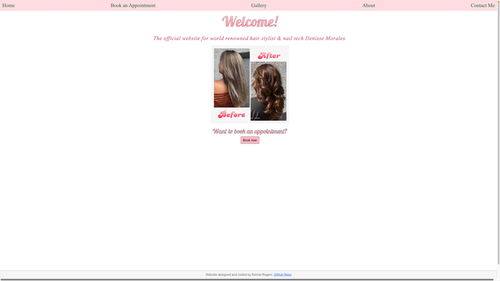
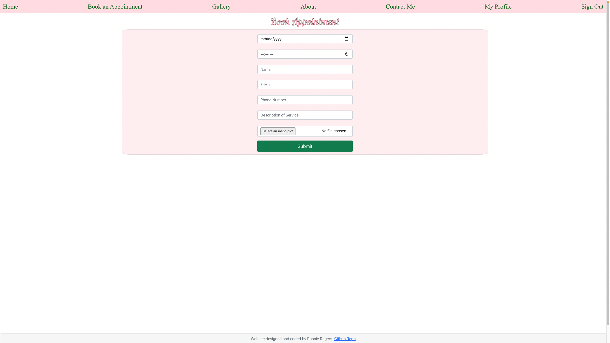
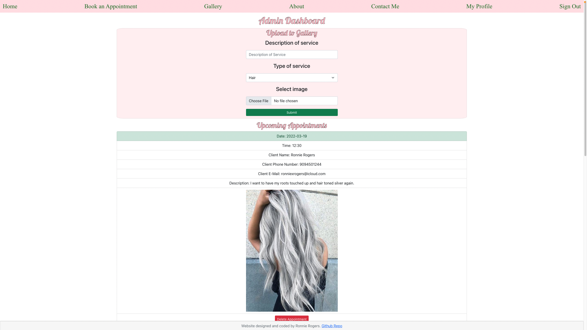
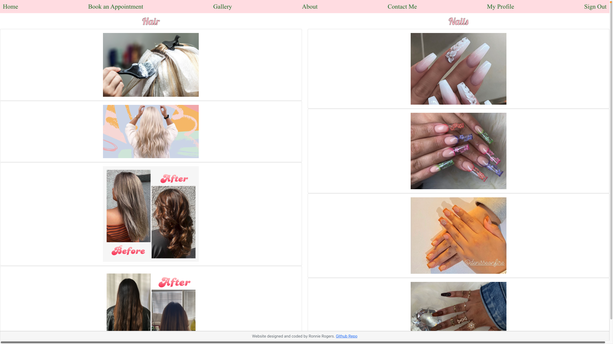

<h1>Salon Website</h1>
My Capstone project for my Software Engineering Immersive course with General Assembly is a full stack web application for a salon.
  
<h2>Check it out!</h2>
 
<a href="https://www.denisseonfire.com"> Denisse On Fire </a>
  
<h2>User Stories:</h2>
<ul>
    <li>As a user I'll be able to create an account</li>
    <li>As a user I'll be able to schedule an appointment</li>
    <li>As a user I'll be able to upload inspiration images when creating an appointment</li>
    <li>As a user I'll be able to view a gallery of work the salon has done in the past</li>
    <li>As the salon owner, I'll be able to add photos to the gallery</li>
    <li>As the salon owner, I'll be able to view and delete appointments in my dashboard</li>
</ul>
 
<h2>Technologies Used:</h2>
<ul>
    <li>React JS</li>
    <li>Express JS</li>
    <li>MongoDB</li>
    <li>Node JS</li>
    <li>AWS S3</li>
    <li>ReactStrap</li>
    <li>Site deployed using Heroku and Netlify</li>
</ul>
 
<h2>The application in action:</h2>
 

 
<h3>Stretch Goals:</h3>
<ul>
    <li>Add more info to customer profile including previous appointments and charges</li>
    <li>Add payment processing for clients to pay for their appointments via card</li>
</ul>